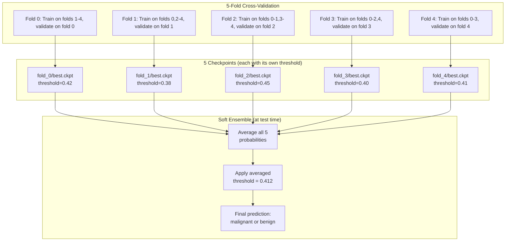
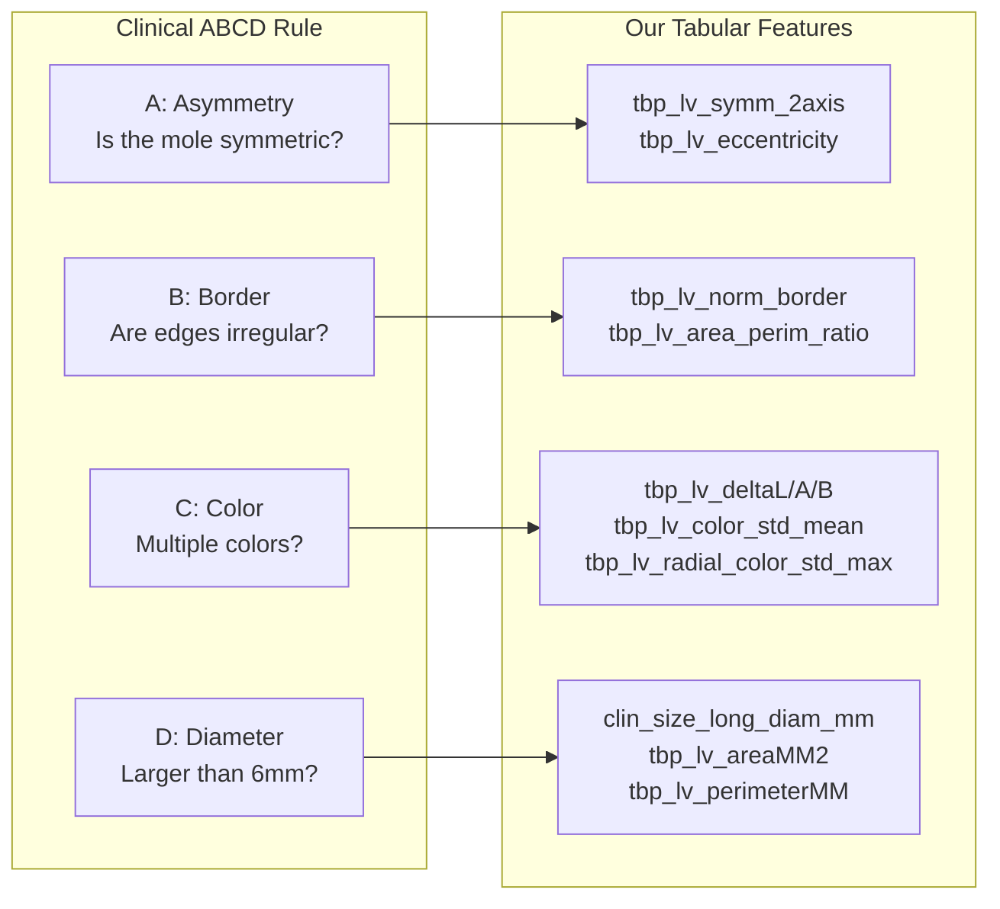

# Skin Cancer Detection — Architecture Documentation

## What This Project Does (In Simple Terms)

This project **detects skin cancer from photos**. Given a photo of a skin lesion (mole/spot) and some clinical measurements, it predicts whether the lesion is **malignant** (cancerous) or **benign** (harmless).

It was built for the [ISIC 2024 Kaggle Competition](https://www.kaggle.com/competitions/isic-2024-challenge), which uses images from 3D Total Body Photography (3D-TBP) — a system that photographs a patient's entire body and extracts crops of individual lesions.

---

## System Overview

```mermaid
flowchart TD
    subgraph Data
        HDF5["🖼️ train-image.hdf5<br/>(~400K JPEG images)"]
        META["📊 train-metadata.csv<br/>(patient info, color,<br/>geometry, 55 columns)"]
    end

    subgraph Training["Training Pipeline (train.py)"]
        DM["ISICDataModule<br/>- Loads images + tabular<br/>- K-fold split<br/>- Augmentations<br/>- Standardization"]
        MODEL["ISICLitModule<br/>- TIMM backbone<br/>- Fusion MLP<br/>- BCEWithLogitsLoss"]
        TRAINER["Lightning Trainer<br/>- Mixed precision (FP16)<br/>- CosineAnnealing LR<br/>- Early stopping<br/>- WandB logging"]
    end

    subgraph Output
        CKPT["💾 Checkpoints<br/>(.ckpt files with<br/>threshold + AUROC)"]
        WANDB["📈 WandB Dashboard<br/>(loss, AUROC, ROC curves)"]
    end

    subgraph Inference["Submission Pipeline (submission.ipynb)"]
        LOAD["Load checkpoints<br/>+ test data"]
        PREDICT["Forward pass<br/>(image + tabular)"]
        ENSEMBLE["Ensemble<br/>(avg probabilities)"]
        CSV["submission.csv"]
    end

    HDF5 --> DM
    META --> DM
    DM --> MODEL
    MODEL --> TRAINER
    TRAINER --> CKPT
    TRAINER --> WANDB
    CKPT --> LOAD
    LOAD --> PREDICT
    PREDICT --> ENSEMBLE
    ENSEMBLE --> CSV
```



---

## How the Model Works

### The Problem with Just Looking at Photos

A photo alone often isn't enough to tell if a mole is cancerous. Dermatologists also consider:
- **Patient age** (risk increases with age)
- **Location on body** (some sites are higher risk)
- **Lesion size, shape, and color** relative to surrounding skin

Our model does the same — it looks at both the **image** and these **clinical measurements** (tabular features).

### Image + Tabular Fusion

```mermaid
flowchart LR
    subgraph Image_Path["Image Path"]
        IMG["Skin Lesion Photo<br/>384×384 pixels"]
        AUG["Augmentations<br/>(crop, flip, color jitter,<br/>dropout)"]
        BACKBONE["TIMM Backbone<br/>(e.g. EfficientNet-B0)<br/>ImageNet pretrained"]
        FEAT["Image Features<br/>(1280-dim vector)"]
    end

    subgraph Tabular_Path["Tabular Path"]
        TAB["42 Clinical Features<br/>(age, size, color,<br/>symmetry, ...)"]
        NORM["Standardize<br/>(zero mean,<br/>unit variance)"]
        TABOUT["Tabular Vector<br/>(42-dim)"]
    end

    subgraph Fusion["Fusion"]
        CONCAT["Concatenate<br/>(1280 + 42 = 1322 dims)"]
        MLP["Fusion MLP<br/>1322 → 128 → 1"]
        LOGIT["1 logit → sigmoid<br/>→ probability"]
        PRED["Prediction:<br/>malignant or benign"]
    end

    IMG --> AUG --> BACKBONE --> FEAT
    TAB --> NORM --> TABOUT
    FEAT --> CONCAT
    TABOUT --> CONCAT
    CONCAT --> MLP --> LOGIT --> PRED
```



### Step-by-Step Explanation

1. **Image Path**: The skin lesion photo (384×384) goes through a pre-trained backbone network (like EfficientNet). This backbone was originally trained on ImageNet (millions of everyday objects) and has learned to extract visual features (edges, textures, colors). We strip off its final classification layer and use the **feature vector** it produces (e.g., 1280 numbers that represent the image).

2. **Tabular Path**: 42 clinical measurements are extracted from the metadata CSV. These are standardized so each feature has mean=0 and std=1 (otherwise features with large values like `tbp_lv_y=1500` would dominate over features like `eccentricity=0.9`).

3. **Fusion**: The image feature vector (1280 dims) and tabular vector (42 dims) are concatenated into one long vector (1322 dims). This goes through a small MLP (Multi-Layer Perceptron) that learns to combine both signals:
   ```
   Linear(1322 → 128) → BatchNorm → ReLU → Dropout → Linear(128 → 1)
   ```
   The final output is a single number (logit). We apply sigmoid to get a probability between 0 and 1.

---

## What Are the Tabular Features?

The metadata CSV contains clinical measurements taken by the 3D-TBP system. Here's what each group means:

### Patient Demographics
| Feature | What it is |
|---------|-----------|
| `age_approx` | Patient's approximate age (5-85) |
| `sex` | Male/Female → encoded as 1/0 |
| `anatom_site_general` | Where on the body → one-hot encoded (head, arms, legs, torso, etc.) |

### Lesion Size & Shape
| Feature | What it is |
|---------|-----------|
| `clin_size_long_diam_mm` | Longest diameter in mm |
| `tbp_lv_areaMM2` | Lesion area in mm² |
| `tbp_lv_perimeterMM` | Perimeter in mm |
| `tbp_lv_minorAxisMM` | Shortest diameter |
| `tbp_lv_area_perim_ratio` | How compact/round the shape is |
| `tbp_lv_eccentricity` | How elongated (0=circle, 1=line) |
| `tbp_lv_symm_2axis` | How symmetric the lesion is |

### Lesion Color (LAB Color Space)
The 3D-TBP system measures colors in LAB color space (L=lightness, A=red-green, B=yellow-blue):

| Feature | What it is |
|---------|-----------|
| `tbp_lv_L`, `tbp_lv_A`, `tbp_lv_B` | Lesion color |
| `tbp_lv_Lext`, `tbp_lv_Aext`, `tbp_lv_Bext` | **Surrounding** skin color |
| `tbp_lv_deltaL`, `tbp_lv_deltaA`, `tbp_lv_deltaB` | **Difference** (lesion - surround) |
| `tbp_lv_H`, `tbp_lv_C` | Hue and Chroma (different color representation) |
| `tbp_lv_stdL`, `tbp_lv_stdLExt` | Color variation within lesion/surround |
| `tbp_lv_color_std_mean` | Overall color non-uniformity |
| `tbp_lv_radial_color_std_max` | Max color variation from center to edge |

**Why color matters**: Malignant lesions often have irregular color patterns — multiple shades of brown, black, red, or blue within the same lesion. The `delta` features capture how much the lesion differs from surrounding healthy skin.

### Border & Confidence
| Feature | What it is |
|---------|-----------|
| `tbp_lv_norm_border` | Border regularity score (irregular borders = suspicious) |
| `tbp_lv_norm_color` | Color uniformity score |
| `tbp_lv_nevi_confidence` | DNN confidence that it's a normal mole |
| `tbp_lv_dnn_lesion_confidence` | DNN confidence that it's a lesion at all |

### 3D Body Position
| Feature | What it is |
|---------|-----------|
| `tbp_lv_x`, `tbp_lv_y`, `tbp_lv_z` | 3D coordinates on the body surface |

---

## Data Augmentation (How We Make Training Data More Diverse)

ISIC 2024 images have specific characteristics that our augmentations address:

```mermaid
flowchart LR
    subgraph Original["Original 3D-TBP Image"]
        O["Skin lesion crop<br/>with black borders,<br/>possible hair artifacts"]
    end

    subgraph Augmentations["Training Augmentations (random per image)"]
        A1["🔍 RandomResizedCrop<br/>(zoom to 70-100%)<br/>Removes black borders"]
        A2["↔️ Flip + Rotate<br/>(any orientation)<br/>Lesions look the same<br/>upside down"]
        A3["🎨 Color Jitter<br/>(brightness, contrast,<br/>hue, saturation)<br/>Handles different<br/>camera settings"]
        A4["⬛ CoarseDropout<br/>(random black patches)<br/>Simulates hair<br/>covering the lesion"]
        A5["🌫️ Blur / Noise<br/>(Gaussian, motion)<br/>Handles image<br/>quality variation"]
    end

    O --> A1 --> A2 --> A3 --> A4 --> A5
```



**Why augment?** We only have ~400K images, but we need the model to be robust to:
- Different camera angles (→ flips, rotations)
- Different lighting/color calibration (→ color jitter)
- Hair or artifacts covering the lesion (→ CoarseDropout)
- Lesion being in different parts of the crop (→ RandomResizedCrop)

---

## Training Pipeline

```mermaid
flowchart TD
    subgraph Config["Hydra Configuration"]
        EXP["Experiment YAML<br/>(isic_efficientnet_b0.yaml)"]
        MOD["Model YAML<br/>(efficientnet_b0.yaml)"]
        DAT["Data YAML<br/>(isic2024.yaml)"]
    end

    subgraph Epoch["One Training Epoch"]
        TRAIN["Training Loop<br/>- Forward pass (image + tabular → prediction)<br/>- Compute loss (BCEWithLogitsLoss + pos_weight)<br/>- Backward pass (compute gradients)<br/>- Update weights (AdamW optimizer)"]
        VAL["Validation (every 2 epochs)<br/>- Forward pass only (no gradients)<br/>- Compute AUROC<br/>- Compute ROC curve<br/>- Find optimal threshold<br/>- Log to WandB"]
    end

    subgraph LR["Learning Rate"]
        COSINE["CosineAnnealingLR<br/><br/>Starts at lr=0.0001<br/>Smoothly decays to<br/>lr=0.000001 by<br/>the final epoch"]
    end

    EXP --> TRAIN
    MOD --> TRAIN
    DAT --> TRAIN
    TRAIN --> VAL
    COSINE -.-> TRAIN
```



### Key Training Concepts

**BCEWithLogitsLoss + pos_weight**: Binary Cross-Entropy loss for classification. The `pos_weight` (~199) tells the loss function: "each malignant sample is worth 199 benign samples." Without this, the model would just predict "benign" for everything (since 99.5% of samples ARE benign) and still get 99.5% accuracy.

**CosineAnnealing LR**: The learning rate starts at 0.0001 and smoothly decreases to 0.000001 following a cosine curve. Early in training, we want big steps to learn quickly; near the end, we want tiny steps for fine-tuning.

**Mixed Precision (FP16)**: Uses 16-bit floating point for most computations instead of 32-bit. This is ~2× faster and uses ~half the GPU memory, with negligible quality loss.

---

## Cross-Validation & Ensemble



**Why 5 folds?** Each model only sees 80% of the data during training. By training 5 models on different 80% slices, we:
1. Use ALL data for both training and validation (just not at the same time)
2. Get more robust predictions by averaging 5 opinions
3. Reduce overfitting (no single model memorizes the data)

**Patient-level splitting**: We split by `patient_id`, not by image. This prevents data leakage — if the same patient has 10 lesion photos, all 10 go into the same fold.

---

## ABCD Rule Connection

Dermatologists use the **ABCD rule** to evaluate moles. Our tabular features capture the same concepts:



---

## File Structure

```
Skin-Cancer-Detection/
├── configs/
│   ├── experiment/          # Complete experiment configs (model+data+trainer)
│   │   ├── isic_efficientnet_b0.yaml
│   │   ├── isic_convnext_tiny.yaml
│   │   └── ...
│   ├── model/               # Model backbone configs
│   │   ├── efficientnet_b0.yaml
│   │   └── ...
│   ├── callbacks/           # Checkpoint & early stopping
│   └── logger/              # WandB logger config
├── src/
│   ├── models/
│   │   └── isic_module.py   # 🧠 THE MODEL (backbone + fusion MLP + training logic)
│   ├── data/
│   │   ├── isic_datamodule.py  # 📊 DATA LOADING (images + tabular features)
│   │   └── components/
│   │       └── transforms.py   # 🔄 AUGMENTATIONS (for training only)
│   ├── ensemble_predict.py  # 🔮 INFERENCE CLI (multi-model ensemble)
│   └── train.py             # 🚀 ENTRY POINT (Hydra-based)
├── notebooks/
│   ├── skin-cancer-detection.ipynb  # Training notebook (Kaggle/Colab)
│   └── submission.ipynb     # Inference-only submission notebook
├── data/
│   └── isic-2024-challenge/  # Competition data (not in git)
├── REFERENCE.md             # Technical reference
└── ARCHITECTURE.md          # This file
```

---

## Tools & Libraries Used

| Tool | What it does | Why we use it |
|------|-------------|---------------|
| **PyTorch** | Deep learning framework | Core tensor operations, autograd, GPU support |
| **Lightning** | Training framework | Handles training loop, logging, checkpoints, multi-GPU — so we only write model logic |
| **TIMM** | Pre-trained model zoo | Provides 700+ ImageNet-pretrained backbones (EfficientNet, ConvNeXt, Swin, etc.) |
| **Hydra** | Configuration management | Mix-and-match experiment configs (change model, data, or training settings independently) |
| **Albumentations** | Image augmentation | Fast, GPU-friendly augmentation pipeline for training |
| **torchmetrics** | Metric computation | Efficient AUROC and ROC curve computation across distributed training |
| **WandB** | Experiment tracking | Logs training curves, ROC plots, hyperparameters — all viewable in a web dashboard |
| **h5py** | HDF5 file I/O | Reads images from the competition's compressed HDF5 format efficiently |
| **pandas** | Data manipulation | Loads and processes the metadata CSV |

---

## How to Run

### Training (on Kaggle)
1. Open `notebooks/skin-cancer-detection.ipynb` in Kaggle
2. Attach the `isic-2024-challenge` dataset
3. Set `MODELS_TO_TRAIN` and `FOLDS_TO_TRAIN` in Cell 4
4. Run all cells → checkpoints saved to `/kaggle/working/checkpoints/`

### Submission (on Kaggle)
1. Open `notebooks/submission.ipynb`
2. Attach competition data + your training notebook output as a dataset
3. Set `MODEL_DATASETS` in Cell 1
4. Run all cells → `submission.csv` generated
5. Submit the notebook to the competition
