# Gradio Demo — Skin Cancer Detection UI

A web-based prediction interface for the ISIC 2024 skin cancer detection model. Upload a skin lesion image, select model checkpoint(s), and get a malignant/benign prediction with confidence score.

---

## Quick Start (Google Colab — recommended)

Copy this entire cell into a Colab notebook with **GPU runtime** enabled:

```python
# 1. Install dependencies
!pip install -q gradio timm albumentations pytorch-lightning torchmetrics

# 2. Clone your repo (or upload checkpoints manually)
!git clone https://github.com/YOUR_USERNAME/Skin-Cancer-Detection.git
%cd Skin-Cancer-Detection

# 3. Place your checkpoints in the expected structure:
#    checkpoints/efficientnet_b0/fold_0/epoch_xxx_auroc_xxx.ckpt
#    checkpoints/efficientnet_b0/fold_1/...
#
# If your checkpoints are in Google Drive:
# from google.colab import drive
# drive.mount('/content/drive')
# !cp -r /content/drive/MyDrive/checkpoints ./checkpoints

# 4. Launch the Gradio app with a public link
!python src/gradio_app.py --checkpoint-dir checkpoints --share
```

After running, you'll see output like:
```
Running on local URL:   http://0.0.0.0:7860
Running on public URL:  https://abc123def456.gradio.live   ← Share this link!
```

The **public URL** works for 72 hours. Send it to your supervisor — they can open it in any browser, no setup needed.

---

## How It Works

### Architecture

```mermaid
flowchart LR
    subgraph UI["Gradio Web Interface"]
        IMG_UP["📷 Image Upload"]
        CKPT_SEL["🎛 Checkpoint Selector<br/>(multi-select for ensemble)"]
        META["📋 Patient Metadata<br/>(age, sex, body site)"]
        BTN["🔍 Analyze Button"]
    end

    subgraph Backend["Python Backend (src/gradio_app.py)"]
        LOAD["Load checkpoint(s)"]
        PREPROCESS["Preprocess image<br/>(Resize 256×256 + Normalize)"]
        ENCODE["Encode tabular features<br/>(42-dim vector)"]
        FORWARD["Model forward pass<br/>(image + tabular → logit)"]
        ENSEMBLE["Average probabilities<br/>(if multiple checkpoints)"]
    end

    subgraph Output["Results"]
        PRED["🟢 BENIGN / 🔴 MALIGNANT"]
        CONF["Probability: 0.0234"]
        DET["Per-checkpoint details"]
    end

    IMG_UP --> PREPROCESS
    CKPT_SEL --> LOAD
    META --> ENCODE
    BTN --> FORWARD
    PREPROCESS --> FORWARD
    LOAD --> FORWARD
    ENCODE --> FORWARD
    FORWARD --> ENSEMBLE --> PRED
    ENSEMBLE --> CONF
    ENSEMBLE --> DET
```



### Code Structure

| Function | What it does |
|----------|-------------|
| `discover_checkpoints(dir)` | Scans the checkpoint directory for `.ckpt` files, organized by `model_name/fold_N/` |
| `encode_simple_tabular(age, sex, site)` | Converts the 3 user-facing inputs into the full 43-dim tabular vector. Features the user doesn't provide (color, geometry, etc.) are set to 0 (neutral after standardization) |
| `predict(image, ckpts, age, sex, site)` | Loads each selected checkpoint, runs forward pass, averages probabilities across all checkpoints |
| `build_app(dir, device)` | Constructs the Gradio UI layout — image upload, dropdowns, sliders, and wires them to `predict()` |
| `ISICLitModule` | Inline copy of the model class (so the app works without importing from `src/`) |

### Prediction Flow

1. **User uploads an image** → Gradio passes it as a numpy array (H, W, 3)
2. **User selects checkpoint(s)** → can select multiple for ensemble averaging
3. **User sets metadata** → age slider, sex radio, body site dropdown
4. **On click "Analyze"**:
   - Each checkpoint is loaded with `strict=False` (handles old vs new checkpoints)
   - Image is resized to the model's expected size and normalized
   - If the model has a `fusion_head` (tabular-aware), the 3 user inputs are encoded into a 43-dim vector
   - Forward pass: `model(image_tensor, tabular_tensor)` → logit → sigmoid → probability
   - If multiple checkpoints: probabilities are averaged, thresholds are averaged
5. **Result**: `🟢 BENIGN` or `🔴 MALIGNANT` with probability and per-checkpoint details

### Tabular Feature Handling

The model expects 43 tabular features during training. In the Gradio demo, the user only provides 3 (age, sex, site). The remaining 40 features (color measurements, geometry, DNN confidence, etc.) are set to **0**, which after standardization corresponds to the **mean value** — so the model treats them as "average/unknown." This means predictions are driven primarily by the image, with age/sex/site providing minor corrections.

---

## Configuration

### Checkpoint Directory Structure

The app expects checkpoints organized as:

```
checkpoints/
├── efficientnet_b0/
│   ├── fold_0/
│   │   ├── epoch_019_auroc_0.9817.ckpt  ← best AUROC (auto-selected)
│   │   └── last.ckpt                     ← fallback
│   ├── fold_1/
│   │   └── ...
│   └── fold_4/
├── convnext_tiny/
│   └── fold_0/
│       └── ...
```

The app picks the checkpoint with the **highest AUROC in the filename** for each fold. If no AUROC-named checkpoint exists, it falls back to `last.ckpt`.

### Command-Line Options

```bash
python src/gradio_app.py \
    --checkpoint-dir checkpoints   # where to find .ckpt files
    --share                        # create a public URL (for Colab)
    --port 7860                    # local port (default 7860)
```

---

## Running Locally (without Colab)

If you have PyTorch + CUDA installed locally:

```bash
# Install Gradio
pip install gradio

# Run
python src/gradio_app.py --checkpoint-dir checkpoints
```

Then open `http://localhost:7860` in your browser.

---

## Troubleshooting

| Problem | Fix |
|---------|-----|
| "No checkpoints found" | Check that your checkpoint directory has the `model_name/fold_N/*.ckpt` structure |
| `ModuleNotFoundError: No module named 'lightning'` | The app handles this automatically (falls back to `pytorch_lightning`) |
| `strict=False` warnings | Normal — old checkpoints may lack `criterion.pos_weight` or `fusion_head` weights |
| Colab public link expires | Links last 72 hours. Re-run the cell to get a new one |
| Out of Memory | Select fewer checkpoints in the dropdown, or use smaller models (EfficientNet-B0) |
