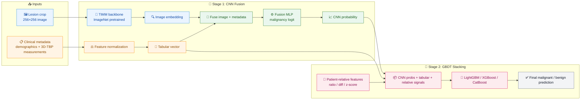

<div align="center">

# 🔬 Skin Cancer Detection with 3D-TBP

**Detect malignant skin lesions from photos and clinical context using a two-stage pipeline: a multimodal CNN first, then GBDT stacking to sharpen screening performance where missed cancers matter most.**

> Demo GIF placeholder: add a short product walkthrough here showing training, CLI inference, and the Gradio demo.

[](https://python.org)
[](https://pytorch.org)
[](https://lightning.ai)
[](https://hydra.cc)
[](LICENSE)
<br>
[](https://www.kaggle.com/competitions/isic-2024-challenge)
[](https://huggingface.co/RudraShivm/skin-cancer-detection-isic2024)
[](https://huggingface.co/spaces/RudraShivm/skin-cancer-detection-demo)
[](https://www.kaggle.com/competitions/isic-2024-challenge)
[](https://www.kaggle.com/competitions/isic-2024-challenge/data)

</div>


---

## Table of Contents

- [Why This Matters](#why-this-matters)
- [Competition Snapshot](#competition-snapshot)
- [Results](#results)
- [Architecture](#architecture)
- [Key Design Decisions](#key-design-decisions)
- [Model Zoo](#model-zoo)
- [Quick Start](#quick-start)
- [Demo](#demo)
- [Project Structure](#project-structure)
- [Documentation](#documentation)
- [Acknowledgments](#acknowledgments)

---

## Why This Matters

Skin cancer is the most common cancer worldwide, and catching malignant lesions early can materially change treatment options and outcomes. The challenge is access: specialist review is limited in many settings, so strong AI systems can help act as a scalable second opinion, especially in underserved regions where dermatology expertise is harder to reach.

This repository was built for the [ISIC 2024: Skin Cancer Detection with 3D-TBP](https://www.kaggle.com/competitions/isic-2024-challenge) Kaggle competition, using lesion crops plus structured clinical metadata from 3D Total Body Photography.

---

## Competition Snapshot

| Item | Value |
|------|-------|
| Task | Binary classification: malignant vs benign skin lesions |
| Data | Dermoscopic lesion crops + 3D-TBP clinical metadata |
| Scale | ~400K lesion images |
| Evaluation | pAUC above 80% TPR |
| Goal | Maximize sensitivity in a clinically realistic screening setup |

> [!NOTE]
> The competition uses **partial AUC (pAUC)** above **80% true positive rate**. That matters in screening: the model is rewarded most for ranking cancers well in the high-sensitivity region, where false negatives are especially costly.

## Results

| System | Private pAUC | Public pAUC |
|--------|--------------|-------------|
| Single CNN model inference | 0.11559 | 0.12447 |
| Multimodal CNN fusion with stage-2 GBDT stacking | 0.13630 | 0.16398 |


---

## Architecture

The current system is intentionally split into two stages. Stage 1 learns a strong multimodal lesion score from pixels plus metadata. Stage 2 treats those CNN outputs as features and lets boosted trees re-rank lesions using structured and patient-relative signals.


```mermaid
flowchart LR
    classDef image fill:#EAF4FF,stroke:#1E88E5,color:#0D47A1,stroke-width:1px;
    classDef tab fill:#FFF4E5,stroke:#FB8C00,color:#8A4B00,stroke-width:1px;
    classDef fusion fill:#EAF7EE,stroke:#2E7D32,color:#1B5E20,stroke-width:1px;
    classDef stack fill:#FDECEF,stroke:#D81B60,color:#880E4F,stroke-width:1px;
    classDef out fill:#F3F4F6,stroke:#6B7280,color:#111827,stroke-width:1px;

    subgraph INPUT["📥 Inputs"]
        IMG["🖼️ Lesion crop<br/>256×256 image"]:::image
        META["📋 Clinical metadata<br/>demographics + 3D-TBP measurements"]:::tab
    end

    subgraph STAGE1["🧠 Stage 1: CNN Fusion"]
        BACKBONE["🧬 TIMM backbone<br/>ImageNet pretrained"]:::image
        IMGFEAT["🔍 Image embedding"]:::image
        NORM["⚖️ Feature normalization"]:::tab
        TABFEAT["🧮 Tabular vector"]:::tab
        CONCAT["🔗 Fuse image + metadata"]:::fusion
        MLP["⚙️ Fusion MLP<br/>malignancy logit"]:::fusion
        CNNPROB["📈 CNN probability"]:::fusion
    end

    subgraph STAGE2["🌲 Stage 2: GBDT Stacking"]
        REL["🧾 Patient-relative features<br/>ratio / diff / z-score"]:::stack
        STACKIN["📦 CNN probs + tabular + relative signals"]:::stack
        GBDT["🌲 LightGBM / XGBoost / CatBoost"]:::stack
        FINAL["✅ Final malignant / benign prediction"]:::out
    end

    IMG --> BACKBONE --> IMGFEAT --> CONCAT
    META --> NORM --> TABFEAT --> CONCAT
    CONCAT --> MLP --> CNNPROB --> STACKIN
    TABFEAT --> STACKIN
    REL --> STACKIN
    STACKIN --> GBDT --> FINAL
```

**Caption:** The first stage learns a lesion representation from image evidence and clinical context. The second stage uses gradient-boosted trees to combine CNN probabilities with tabular and patient-relative features, which is especially effective for structured ranking signals near the competition's high-sensitivity operating region.

Color key: **blue** = image pathway, **amber** = metadata pathway, **green** = multimodal fusion, **rose** = stage-2 stacking.

> 📖 More detail: [docs/architecture.md](docs/architecture.md)

---

## Key Design Decisions

### 1. Optimize for pAUC, not generic AUC

The project is tuned around **pAUC above 80% TPR** because that is the actual competition target and the medically relevant regime for screening. This worked because it pushes model selection toward systems that stay useful when sensitivity must remain high, instead of rewarding performance gains in operating regions that matter less for cancer detection.

### 2. Use multimodal fusion instead of image-only classification

The first stage does not rely on pixels alone. It combines lesion images with structured clinical metadata so the model can use the same kinds of context a dermatologist would care about, such as lesion geometry, body site, and demographic signals. This worked because the metadata branch adds complementary signal that is hard to infer reliably from the image by itself.

### 3. Keep the tabular branch clinically focused

Rather than feeding every available metadata field into the network without constraint, the design uses a curated set of clinically meaningful structured features. This worked because it keeps the fusion head compact, reduces noisy inputs, and makes the second-stage stacker easier to train on features that are already aligned with the diagnostic task.

### 4. Stack GBDTs on top of CNN probabilities

The system treats the multimodal CNN as a strong feature generator, then lets LightGBM, XGBoost, and CatBoost re-rank cases using CNN outputs plus structured inputs. This worked because boosted trees are especially effective at exploiting tabular interactions and calibration-like patterns that remain after the neural network has done the heavy lifting on visual representation learning.

### 5. Add patient-relative normalization and "ugly duckling" signals

Skin lesions are often suspicious not only because of what they are in isolation, but because of how different they look from a patient's other lesions. The pipeline captures that idea with patient-wise standardization and relative features such as ratios, differences, and z-scores. This worked because it turns patient context into explicit model input instead of forcing the model to infer that relationship indirectly.

<!-- TODO: verify and harmonize the exact encoded tabular feature count across docs/code before stating a single number everywhere. -->

---

## Model Zoo

Pretrained checkpoints are hosted on [🤗 Hugging Face](https://huggingface.co/RudraShivm/skin-cancer-detection-isic2024).

| Model | TIMM Backbone | Resolution | Batch Size | Config |
|-------|---------------|------------|------------|--------|
| EfficientNet-B0 | `tf_efficientnet_b0_ns` | 256×256 | 32 | [config](configs/experiment/isic_efficientnet_b0.yaml) |
| MobileNetV3 | `mobilenetv3_large_100.ra_in1k` | 256×256 | 32 | [config](configs/experiment/isic_mobilenet_v3.yaml) |

```bash
# Download all checkpoints from Hugging Face
python scripts/download_checkpoints.py

# Download just one model
python scripts/download_checkpoints.py --model efficientnet_b0
```

---

## Quick Start

### 1. Clone the repo and install dependencies

```bash
git clone https://github.com/RudraShivm/Skin-Cancer-Detection.git
cd Skin-Cancer-Detection

# Conda
conda env create -f environment.yaml
conda activate skin-cancer

# Or pip
pip install -r requirements.txt
```

**Expected:** your environment finishes installing cleanly and the project imports are available from the repo root.

### 2. Download the ISIC 2024 data

Download the competition files from [Kaggle](https://www.kaggle.com/competitions/isic-2024-challenge/data) and place them here:

```text
data/isic-2024-challenge/
├── train-image.hdf5
└── train-metadata.csv
```

**Expected:** both files exist under `data/isic-2024-challenge/`, or the data module will fail fast on startup.

### 3. Set up Hugging Face access

```bash
# Option A: newer CLI
hf auth login

# Option B: classic CLI
huggingface-cli login
```

**Expected:** your local Hugging Face CLI is authenticated and ready to access hosted assets.

### 4. Pull pretrained checkpoints

```bash
python scripts/download_checkpoints.py
```

**Expected:** checkpoint files appear under `checkpoints/{model_name}/fold_{N}/...ckpt`.

### 5. Train a CNN fold

```bash
# Full fold training
python src/train.py experiment=isic_efficientnet_b0 data.fold=0

# Quick debug run
python src/train.py experiment=isic_efficientnet_b0 debug=default
```

**Expected:** Lightning prints train/val split information, reports class imbalance and tabular dimensions, and writes run artifacts under `logs/` with checkpoints under `logs/checkpoints/`.

### 6. Run ensemble inference

```bash
# Single-image prediction
python src/ensemble_predict.py \
    --models efficientnet_b0 \
    --checkpoint-dir checkpoints/ \
    --image-paths path/to/image.jpg

# Batch prediction with CSV output
python src/ensemble_predict.py \
    --models efficientnet_b0 mobilenet_v3 \
    --checkpoint-dir checkpoints/ \
    --image-dir test_images/ \
    --output-csv results.csv
```

**Expected:** the CLI prints per-image probabilities and labels, and optionally saves a `results.csv` file.

### 7. Train the stage-2 GBDT stacker

```bash
# Extract CNN predictions and tabular features
python src/gbdt/extract_cnn_features.py \
    --checkpoint-dir checkpoints/ \
    --data-dir data/isic-2024-challenge \
    --output-dir outputs/gbdt_features

# Train LightGBM / XGBoost / CatBoost stackers
python src/gbdt/train_gbdt.py \
    --features-dir outputs/gbdt_features \
    --output-dir checkpoints/gbdt
```

**Expected:** `outputs/gbdt_features/fold_*_features.csv` is created first, then trained `.pkl` models and a `training_summary.json` appear under `checkpoints/gbdt/`.

---

## Demo

The interactive demo lives in the `demo/` submodule and deploys directly to [Hugging Face Spaces](https://huggingface.co/spaces/RudraShivm/skin-cancer-detection-demo).

```bash
git submodule update --init --recursive
python demo/app.py
```

**Expected:** the local Gradio app starts on `http://localhost:7860` and uses checkpoints from the parent repository.

> 📖 Setup notes: [docs/gradio-demo.md](docs/gradio-demo.md)

---

## Project Structure

```text
Skin-Cancer-Detection/
├── configs/
│   ├── experiment/
│   ├── model/
│   ├── callbacks/
│   ├── logger/
│   └── ...
├── src/
│   ├── data/
│   ├── models/
│   ├── gbdt/
│   ├── ensemble_predict.py
│   └── train.py
├── scripts/
├── notebooks/
├── docs/
├── demo/
├── checkpoints/
├── outputs/
├── data/
└── tests/
```

### Legend

| Path | What it does |
|------|---------------|
| `configs/` | Hydra configuration tree for experiments, models, callbacks, trainers, and paths. |
| `src/` | Core Python implementation for data loading, multimodal models, training, inference, and GBDT stacking. |
| `scripts/` | Utility scripts, including checkpoint download helpers. |
| `notebooks/` | Kaggle-friendly notebooks for training, experimentation, and submission workflows. |
| `docs/` | Long-form technical references for architecture, demo setup, and future improvements. |
| `demo/` | Gradio application packaged as a Hugging Face Spaces-ready submodule. |
| `checkpoints/` | Local storage for downloaded or exported model weights and trained GBDT artifacts. |
| `outputs/` | Generated intermediate artifacts such as extracted GBDT feature CSVs. |
| `data/` | Local competition files kept out of version control. |
| `tests/` | Automated tests and helpers for validating project behavior. |

---

## Documentation

| Document | Description |
|----------|-------------|
| [Architecture](docs/architecture.md) | System diagrams, multimodal fusion details, training pipeline, and stacking design |
| [Gradio Demo](docs/gradio-demo.md) | Local launch instructions, Spaces deployment, and troubleshooting |

---

## Acknowledgments

- [ISIC 2024 Challenge](https://www.kaggle.com/competitions/isic-2024-challenge) for the dataset and problem framing
- [Lightning-Hydra-Template](https://github.com/ashleve/lightning-hydra-template) for the project foundation
- [TIMM](https://github.com/huggingface/pytorch-image-models) for pretrained backbones
- [PyTorch Lightning](https://lightning.ai) for the training framework
- [Hydra](https://hydra.cc) for configuration management
