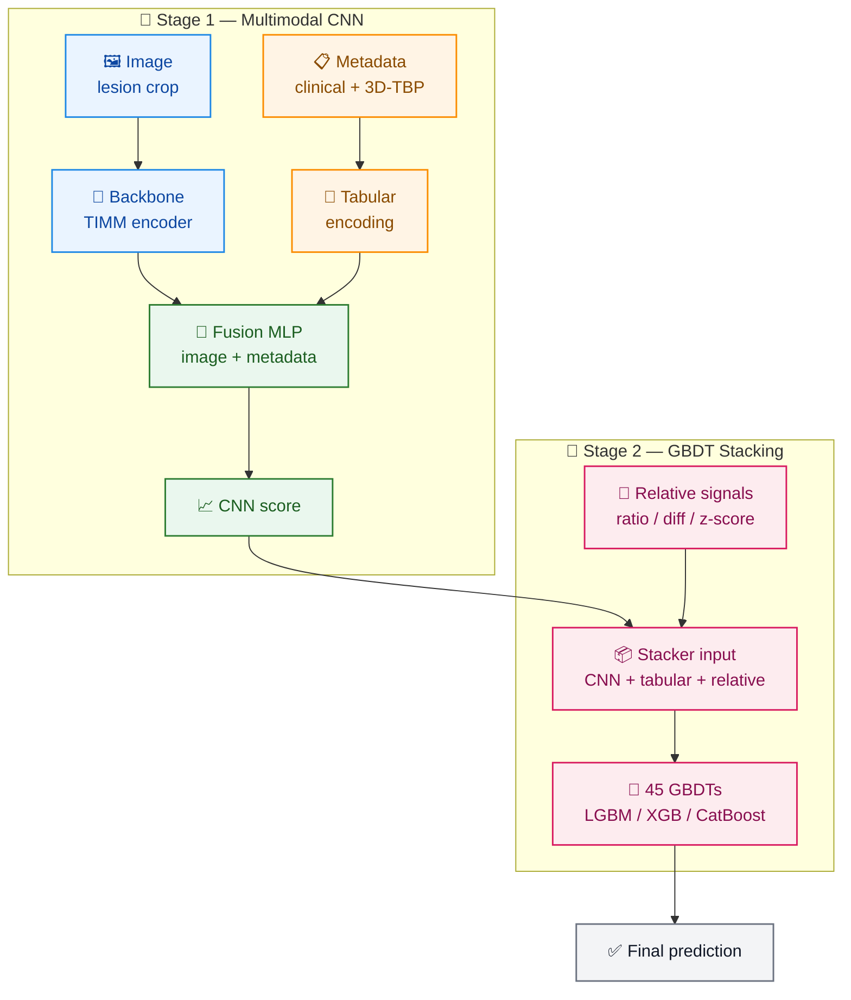
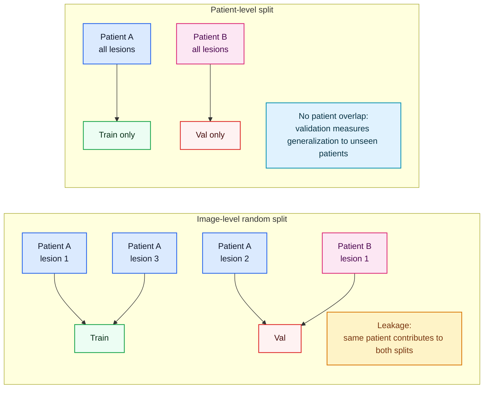
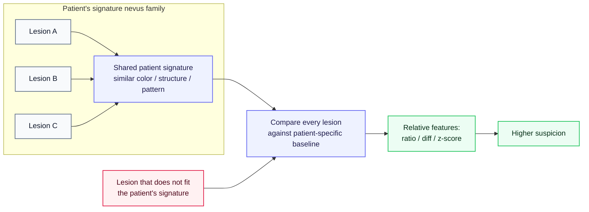

<div align="center">

# 🔬 Skin Cancer Detection with 3D-TBP

**Detect malignant skin lesions from photos and clinical context using a two-stage pipeline: a multimodal CNN first, then GBDT stacking to optimize diagnostic sensitivity and minimize false negatives in clinical screening environments.**

[](https://python.org)
[](https://pytorch.org)
[](https://lightning.ai)
[](https://hydra.cc)
[](LICENSE)
<br>
[](https://www.kaggle.com/competitions/isic-2024-challenge)
[](https://huggingface.co/RudraShivm/skin-cancer-detection-isic2024)
[](https://huggingface.co/spaces/RudraShivm/skin-cancer-detection-demo)
[](https://www.kaggle.com/competitions/isic-2024-challenge)
[](https://www.kaggle.com/competitions/isic-2024-challenge/data)

</div>


---

## 📑 Table of Contents

- [💡 Why This Matters](#-why-this-matters)
- [✨ Key Highlights](#-key-highlights)
- [Competition Snapshot](#competition-snapshot)
- [Results](#results)
- [Architecture](#architecture)
- [Key Design Decisions](#key-design-decisions)
- [Model Zoo](#model-zoo)
- [ONNX / INT8 Benchmark](#onnx--int8-benchmark)
- [Quick Start](#quick-start)
- [Demo](#demo)
- [Project Structure](#project-structure)
- [Documentation](#documentation)
- [Acknowledgments](#acknowledgments)

---

## 💡 Why This Matters

Skin cancer is the most common cancer worldwide. Catching malignant lesions early can drastically improve treatment outcomes. However, **specialist review is geographically and economically constrained**.

This project provides an open-source, robust AI system that acts as a scalable second opinion. Built for the [ISIC 2024: Skin Cancer Detection with 3D-TBP](https://www.kaggle.com/competitions/isic-2024-challenge) Kaggle competition, it combines lesion images with structured clinical metadata (from 3D Total Body Photography) to emulate the holistic review process of a real dermatologist.


---

## Competition Snapshot

| Item | Value |
|------|-------|
| Task | Binary classification: malignant vs benign skin lesions |
| Data | Dermoscopic lesion crops + 3D-TBP clinical metadata |
| Scale | ~400K lesion images |
| Evaluation | pAUC above 80% TPR |
| Goal | Maximize sensitivity in a clinically realistic screening setup |

> [!NOTE]
> The competition uses **partial AUC (pAUC)** above **80% true positive rate**. That matters in screening: the model is rewarded most for ranking cancers well in the high-sensitivity region, where false negatives are especially costly.

## Kaggle Submission Results

| System | Private pAUC | Public pAUC |
|--------|--------------|-------------|
| Single CNN model inference | 0.11559 | 0.12447 |
| Multimodal CNN fusion with stage-2 GBDT stacking | 0.13630 | 0.16398 |


---

## Architecture

The current system is intentionally split into two stages. Stage 1 learns a strong multimodal lesion score from pixels plus metadata. Stage 2 treats those CNN outputs as features and lets boosted trees re-rank lesions using structured and patient-relative signals.


```mermaid
flowchart TD
    classDef image fill:#EAF4FF,stroke:#1E88E5,color:#0D47A1,stroke-width:1.5px;
    classDef tab fill:#FFF4E5,stroke:#FB8C00,color:#8A4B00,stroke-width:1.5px;
    classDef fusion fill:#EAF7EE,stroke:#2E7D32,color:#1B5E20,stroke-width:1.5px;
    classDef stack fill:#FDECEF,stroke:#D81B60,color:#880E4F,stroke-width:1.5px;
    classDef out fill:#F3F4F6,stroke:#6B7280,color:#111827,stroke-width:1.5px;

    subgraph S1["🧠 Stage 1 — Multimodal CNN"]
        direction LR
        IMG["🖼️ Image<br/>lesion crop"]:::image --> BACKBONE["🧬 Backbone<br/>TIMM encoder"]:::image
        META["📋 Metadata<br/>clinical + 3D-TBP"]:::tab --> TAB["🧮 Tabular<br/>encoding"]:::tab
        BACKBONE --> FUSE["🔗 Fusion MLP<br/>image + metadata"]:::fusion
        TAB --> FUSE
        FUSE --> CNN["📈 CNN score"]:::fusion
    end

    CNN --> STACKIN

    subgraph S2["🌲 Stage 2 — GBDT Stacking"]
        direction LR
        REL["🦆 Relative signals<br/>ratio / diff / z-score"]:::stack --> STACKIN["📦 Stacker input<br/>CNN + tabular + relative"]:::stack
        STACKIN --> GBDT["🌲 45 GBDTs<br/>LGBM / XGB / CatBoost"]:::stack
    end

    GBDT --> FINAL["✅ Final prediction"]:::out
```

**Caption:** Stage 1 learns a multimodal lesion score from pixels plus structured metadata. Stage 2 re-ranks that signal with boosted trees using tabular and patient-relative cues, which is where the ugly duckling context becomes explicit.

Color key: **blue** = image pathway, **amber** = metadata pathway, **green** = multimodal fusion, **rose** = stage-2 stacking.

> 📖 More detail: [docs/architecture.md](docs/architecture.md)

---

## Key Design Decisions

### 1. Optimize for pAUC, not generic AUC

The project is tuned around **pAUC above 80% TPR** because that is the competition target and the screening setting is recall-sensitive. The impact is simple: model selection is pushed toward systems that keep cancers ranked high where false negatives hurt most.

### 2. Split by patient, not by image

Cross-validation is built with **patient-level stratified folds**, not random image splits. That matters because the same patient can contribute multiple lesions; splitting by `patient_id` prevents leakage and produces a more honest validation signal.


```mermaid
flowchart LR
    classDef patientA fill:#DBEAFE,stroke:#2563EB,color:#0F172A,stroke-width:1.5px;
    classDef patientB fill:#FCE7F3,stroke:#DB2777,color:#4A044E,stroke-width:1.5px;
    classDef train fill:#ECFDF3,stroke:#16A34A,color:#052E16,stroke-width:1.5px;
    classDef val fill:#FEF2F2,stroke:#DC2626,color:#450A0A,stroke-width:1.5px;
    classDef bad fill:#FEF3C7,stroke:#D97706,color:#78350F,stroke-width:1.5px;
    classDef good fill:#E0F2FE,stroke:#0891B2,color:#083344,stroke-width:1.5px;

    subgraph Wrong["Image-level random split"]
        direction TB
        WA1["Patient A<br/>lesion 1"]:::patientA --> WTR["Train"]:::train
        WA2["Patient A<br/>lesion 2"]:::patientA --> WVA["Val"]:::val
        WA3["Patient A<br/>lesion 3"]:::patientA --> WTR
        WB1["Patient B<br/>lesion 1"]:::patientB --> WVA
        LEAK["Leakage:<br/>same patient contributes to both splits"]:::bad
    end

    subgraph Right["Patient-level split"]
        direction TB
        RA["Patient A<br/>all lesions"]:::patientA --> RTR["Train only"]:::train
        RB["Patient B<br/>all lesions"]:::patientB --> RVA["Val only"]:::val
        HONEST["No patient overlap:<br/>validation measures generalization to unseen patients"]:::good
    end
```

```python
patient_targets = df.groupby("patient_id")["target"].mean()
patient_targets = (patient_targets > 0.5).astype(int)
skf = StratifiedKFold(n_splits=5, shuffle=True, random_state=42)
```

### 3. Use multimodal fusion instead of image-only classification

Stage 1 combines lesion images with structured metadata rather than relying on pixels alone. That gives the model access to geometry, site, demographic, and 3D-TBP signals that are hard to infer reliably from the image by itself.

### 4. Keep the tabular branch clinically focused

The metadata branch uses a curated set of clinically meaningful columns instead of every raw field in the CSV. This keeps the fusion head compact and makes the second-stage stacker easier to train on cleaner structured inputs.

### 5. Add patient-relative normalization and "ugly duckling" signals

The pipeline does not only ask whether a lesion looks suspicious in isolation; it also asks whether it looks unusual **for that patient**. Patient-wise standardization plus ratio/diff/z-score features turn that intuition into explicit model input.


```mermaid
flowchart LR
    classDef signature fill:#F8FAFC,stroke:#64748B,color:#0F172A,stroke-width:1.5px;
    classDef compare fill:#EEF2FF,stroke:#6366F1,color:#1E1B4B,stroke-width:1.5px;
    classDef outlier fill:#FFF1F2,stroke:#E11D48,color:#4C0519,stroke-width:1.5px;
    classDef signal fill:#ECFDF3,stroke:#22C55E,color:#052E16,stroke-width:1.5px;

    subgraph Family["Patient's signature nevus family"]
        direction LR
        N1["Lesion A"]:::signature
        N2["Lesion B"]:::signature
        N3["Lesion C"]:::signature
        SIG["Shared patient signature<br/>similar color / structure / pattern"]:::compare
        N1 --> SIG
        N2 --> SIG
        N3 --> SIG
    end

    DUCK["Lesion that does not fit<br/>the patient's signature"]:::outlier
    SIG --> CMP["Compare every lesion<br/>against patient-specific baseline"]:::compare
    DUCK --> CMP
    CMP --> OUT["Relative features:<br/>ratio / diff / z-score"]:::signal
    OUT --> FLAG["Higher suspicion"]:::signal
```

### 6. Stack GBDTs on top of CNN probabilities

The GBDT stage learns on top of CNN scores, tabular features, and patient-relative signals. This works well because trees are strong at exploiting structured feature interactions and re-ranking borderline cases after the CNN has already extracted visual signal.

### 7. Inject noise and average across seeds in Stage 2

The stacker is not trained as one fragile tree model. It uses **LightGBM, XGBoost, and CatBoost** across multiple folds and seeds, and adds Gaussian noise to CNN probabilities during GBDT training so the trees do not overfit to raw CNN outputs.

```python
# 3 tree families × 5 folds × 3 seeds = 45 stage-2 models
seeds: [2105152, 2105163, 2105170]
noise_sigma: 0.1
```

---

## Model Zoo

Pretrained checkpoints are hosted on [🤗 Hugging Face](https://huggingface.co/RudraShivm/skin-cancer-detection-isic2024).

| Model | TIMM Backbone | Resolution | Batch Size | Config |
|-------|---------------|------------|------------|--------|
| EfficientNet-B0 | `tf_efficientnet_b0_ns` | 256×256 | 32 | [config](configs/experiment/isic_efficientnet_b0.yaml) |
| MobileNetV3 | `mobilenetv3_large_100.ra_in1k` | 256×256 | 32 | [config](configs/experiment/isic_mobilenet_v3.yaml) |

```bash
# Download all checkpoints from Hugging Face
python scripts/download_checkpoints.py

# Download just one model
python scripts/download_checkpoints.py --model efficientnet_b0
```

---

## ONNX / INT8 Benchmark

To test edge-deployment feasibility, one MobileNetV3 fold checkpoint was exported to ONNX and quantized with post-training static INT8 quantization. This benchmark uses the held-out validation fold for that checkpoint, so it measures FP32 vs INT8 on unseen fold-2 validation data rather than training rows.

| Variant | Size | Mean Latency / Image | P95 | P99 | AUROC | pAUC |
|---------|------|----------------------|-----|-----|-------|------|
| FP32 ONNX | 16.69 MB | 4.48 ms | 4.59 ms | 5.74 ms | 0.97963 | 0.94735 |
| INT8 ONNX | 4.67 MB | 9.95 ms | 11.40 ms | 11.59 ms | 0.96075 | 0.91325 |

**Benchmark setup:** MobileNetV3 fold-2 checkpoint, validation fold 2, 256x256 images, batch size 16, ONNX Runtime `CPUExecutionProvider`.

**Takeaway:** INT8 reduced model size by **3.57x**, but it was slower in this CPU runtime setup and reduced AUROC by **0.01888** and pAUC by **0.03409**. That makes the INT8 artifact useful as a compact deployment experiment, but not automatically better than FP32 for latency on this machine.

```bash
# Quantize the exported ONNX model
python src/onnx/onnx_int8_quant.py

# Benchmark FP32 vs INT8 on the held-out validation fold
python src/onnx/onnx_benchmark.py
```

---

## Quick Start

### 1. Clone the repo and install dependencies

```bash
git clone https://github.com/RudraShivm/Skin-Cancer-Detection.git
cd Skin-Cancer-Detection

# Conda
conda env create -f environment.yaml
conda activate skin-cancer

# Or pip
pip install -r requirements.txt
```

**Expected:** your environment finishes installing cleanly and the project imports are available from the repo root.

### 2. Download the ISIC 2024 data

Download the competition files from [Kaggle](https://www.kaggle.com/competitions/isic-2024-challenge/data) and place them here:

```text
data/isic-2024-challenge/
├── train-image.hdf5
└── train-metadata.csv
```

**Expected:** both files exist under `data/isic-2024-challenge/`, or the data module will fail fast on startup.

### 3. Set up Hugging Face access

```bash
# Option A: newer CLI
hf auth login

# Option B: classic CLI
huggingface-cli login
```

**Expected:** your local Hugging Face CLI is authenticated and ready to access hosted assets.

### 4. Pull pretrained checkpoints

```bash
python scripts/download_checkpoints.py
```

**Expected:** checkpoint files appear under `checkpoints/{model_name}/fold_{N}/...ckpt`.

### 5. Train a CNN fold

```bash
# Full fold training
python src/train.py experiment=isic_efficientnet_b0 data.fold=0

# Quick debug run
python src/train.py experiment=isic_efficientnet_b0 debug=default
```

**Expected:** Lightning prints train/val split information, reports class imbalance and tabular dimensions, and writes run artifacts under `logs/` with checkpoints under `logs/checkpoints/`.

### 6. Run ensemble inference

```bash
# Single-image prediction
python src/ensemble_predict.py \
    --models efficientnet_b0 \
    --checkpoint-dir checkpoints/ \
    --image-paths path/to/image.jpg

# Batch prediction with CSV output
python src/ensemble_predict.py \
    --models efficientnet_b0 mobilenet_v3 \
    --checkpoint-dir checkpoints/ \
    --image-dir test_images/ \
    --output-csv results.csv
```

**Expected:** the CLI prints per-image probabilities and labels, and optionally saves a `results.csv` file.

### 7. Train the stage-2 GBDT stacker

```bash
# Extract CNN predictions and tabular features
python src/gbdt/extract_cnn_features.py \
    --checkpoint-dir checkpoints/ \
    --data-dir data/isic-2024-challenge \
    --output-dir outputs/gbdt_features

# Train LightGBM / XGBoost / CatBoost stackers
python src/gbdt/train_gbdt.py \
    --features-dir outputs/gbdt_features \
    --output-dir checkpoints/gbdt
```

**Expected:** `outputs/gbdt_features/fold_*_features.csv` is created first, then trained `.pkl` models and a `training_summary.json` appear under `checkpoints/gbdt/`.

---

## Demo

The interactive demo lives in the `demo/` submodule and deploys directly to [Hugging Face Spaces](https://huggingface.co/spaces/RudraShivm/skin-cancer-detection-demo).

```bash
git submodule update --init --recursive
python demo/app.py
```

**Expected:** the local Gradio app starts on `http://localhost:7860` and uses checkpoints from the parent repository.

> 📖 Setup notes: [docs/gradio-demo.md](docs/gradio-demo.md)

---

## Project Structure

```text
Skin-Cancer-Detection/
├── configs/
│   ├── experiment/
│   ├── model/
│   ├── callbacks/
│   ├── logger/
│   └── ...
├── src/
│   ├── data/
│   ├── models/
│   ├── gbdt/
│   ├── onnx/
│   ├── ensemble_predict.py
│   └── train.py
├── scripts/
├── notebooks/
├── docs/
├── demo/
├── checkpoints/
├── onnx_models/
├── outputs/
├── data/
└── tests/
```

### Legend

| Path | What it does |
|------|---------------|
| `configs/` | Hydra configuration tree for experiments, models, callbacks, trainers, and paths. |
| `src/` | Core Python implementation for data loading, multimodal models, training, inference, and GBDT stacking. |
| `src/onnx/` | ONNX export, simplification, INT8 quantization, and benchmarking utilities. |
| `scripts/` | Utility scripts, including checkpoint download helpers. |
| `notebooks/` | Kaggle-friendly notebooks for training, experimentation, and submission workflows. |
| `docs/` | Long-form technical references for architecture, demo setup, and future improvements. |
| `demo/` | Gradio application packaged as a Hugging Face Spaces-ready submodule. |
| `checkpoints/` | Local storage for downloaded or exported model weights and trained GBDT artifacts. |
| `onnx_models/` | Generated ONNX deployment artifacts, including FP32, simplified, preprocessed, and INT8 models. |
| `outputs/` | Generated intermediate artifacts such as extracted GBDT feature CSVs. |
| `data/` | Local competition files kept out of version control. |
| `tests/` | Automated tests and helpers for validating project behavior. |

---

## Documentation

| Document | Description |
|----------|-------------|
| [Architecture](docs/architecture.md) | System diagrams, multimodal fusion details, training pipeline, and stacking design |
| [Gradio Demo](docs/gradio-demo.md) | Local launch instructions, Spaces deployment, and troubleshooting |

---

## Acknowledgments

- [ISIC 2024 Challenge](https://www.kaggle.com/competitions/isic-2024-challenge) for the dataset and problem framing
- [Lightning-Hydra-Template](https://github.com/ashleve/lightning-hydra-template) for the project foundation
- [TIMM](https://github.com/huggingface/pytorch-image-models) for pretrained backbones
- [PyTorch Lightning](https://lightning.ai) for the training framework
- [Hydra](https://hydra.cc) for configuration management
