<div align="center">

# 🔬 Skin Cancer Detection with 3D-TBP

**Deep learning pipeline for detecting skin cancer from lesion images + clinical metadata**

[](https://python.org)
[](https://pytorch.org)
[](https://lightning.ai)
[](https://hydra.cc)
[](LICENSE)
<br>
[](https://www.kaggle.com/competitions/isic-2024-challenge)
[](https://huggingface.co/RudraShivm/skin-cancer-detection-isic2024)

</div>

---

## 📋 About

This project builds a **binary classification system** that predicts whether a skin lesion is **malignant** or **benign** using both dermoscopic images and clinical metadata from [3D Total Body Photography (3D-TBP)](https://www.kaggle.com/competitions/isic-2024-challenge).

Built for the [**ISIC 2024 — Skin Cancer Detection with 3D-TBP**](https://www.kaggle.com/competitions/isic-2024-challenge) Kaggle competition, organized by the International Skin Imaging Collaboration (ISIC). The challenge asks participants to develop image-based algorithms to identify histologically confirmed skin cancer cases from crops of 3D-TBP images.

### Why It Matters

> Skin cancer is the most common cancer worldwide. Early detection dramatically improves survival rates. While dermatologists achieve ~85% accuracy, AI systems can serve as a **second opinion** — especially in areas with limited specialist access. This competition pushes the boundary with a clinically realistic dataset of ~400K lesion images.

---

## 🏆 Competition Score

| Metric | Score |
|--------|-------|
| **Private Score** | **0.11559** |
| **Public Score** | **0.12447** |

<!-- 
  To update scores: replace the values above.
  Scores range from 0.0 to 0.2 (higher is better).
-->

> [!NOTE]
> **Evaluation Metric**: Submissions are scored using **partial Area Under the ROC Curve (pAUC)** above **80% True Positive Rate (TPR)**. This metric ranges from **0.0** (worst) to **0.2** (perfect), where **0.02** represents a random classifier. The 80% TPR floor ensures models prioritize high sensitivity — critical for cancer screening where missing a malignant case is far worse than a false alarm.
>
> 📖 [Full evaluation details](https://www.kaggle.com/competitions/isic-2024-challenge/overview/evaluation)

---

## 🏗️ Architecture

The model fuses **image features** from a pretrained CNN/Transformer backbone with **42 clinical tabular features** (patient demographics, lesion color/shape/symmetry measurements) through a learned MLP head.

```mermaid
flowchart LR
    subgraph Image["Image Path"]
        IMG["Skin Lesion<br/>256×256 px"] --> BACKBONE["TIMM Backbone<br/>(e.g. EfficientNet-B0)<br/>ImageNet pretrained"]
        BACKBONE --> FEAT["Image Features<br/>(1280-dim)"]
    end

    subgraph Tabular["Tabular Path"]
        TAB["42 Clinical Features<br/>(age, color, shape,<br/>symmetry, ...)"] --> NORM["Standardize<br/>(zero mean, unit var)"]
        NORM --> TVEC["Tabular Vector<br/>(42-dim)"]
    end

    subgraph Fusion["Fusion Head"]
        CONCAT["Concatenate"] --> MLP["MLP<br/>1322 → 128 → 1"]
        MLP --> PRED["Malignant /<br/>Benign"]
    end

    FEAT --> CONCAT
    TVEC --> CONCAT
```



> 📖 **Detailed architecture docs**: [docs/architecture.md](docs/architecture.md)

---

## 🧠 Model Zoo

All models are available as pretrained checkpoints on [🤗 Hugging Face](https://huggingface.co/RudraShivm/skin-cancer-detection-isic2024):

| Model | TIMM Backbone | Resolution | Batch Size | Config |
|-------|--------------|------------|------------|--------|
| EfficientNet-B0 | `tf_efficientnet_b0_ns` | 256×256 | 32 | [config](configs/experiment/isic_efficientnet_b0.yaml) |
| MobileNetV3 | `mobilenetv3_large_100.ra_in1k` | 256×256 | 32 | [config](configs/experiment/isic_mobilenet_v3.yaml) |

```bash
# Download all checkpoints from Hugging Face
python scripts/download_checkpoints.py

# Download only a specific model
python scripts/download_checkpoints.py --model efficientnet_b0
```

---

## 🚀 Quick Start

### 1. Setup Environment

```bash
git clone https://github.com/RudraShivm/Skin-Cancer-Detection.git
cd Skin-Cancer-Detection

# Create conda environment
conda env create -f environment.yaml
conda activate skin-cancer

# Or install with pip
pip install -r requirements.txt
```

### 2. Download Data

Download the [ISIC 2024 dataset](https://www.kaggle.com/competitions/isic-2024-challenge/data) and place it in:

```
data/isic-2024-challenge/
├── train-image.hdf5
└── train-metadata.csv
```

### 3. Download Checkpoints

```bash
# Download pretrained checkpoints from Hugging Face Hub
python scripts/download_checkpoints.py
```

### 4. Train a Model

```bash
# Train EfficientNet-B0 on fold 0
python src/train.py experiment=isic_efficientnet_b0 data.fold=0

# Train with WandB logging
python src/train.py experiment=isic_efficientnet_b0 data.fold=0 logger=wandb

# Quick debug run (1 epoch, small data)
python src/train.py experiment=isic_efficientnet_b0 debug=default
```

### 5. Run Inference

```bash
# Single model prediction
python src/ensemble_predict.py \
    --models efficientnet_b0 \
    --image-paths path/to/image.jpg

# Multi-model ensemble
python src/ensemble_predict.py \
    --models efficientnet_b0 mobilenet_v3 \
    --image-dir test_images/ \
    --output-csv results.csv
```

---

## 🎨 Gradio Demo

A web UI for interactive skin lesion analysis with real-time predictions. The demo is maintained as a submodule that directly deploys to [Hugging Face Spaces](https://huggingface.co/spaces/RudraShivm/skin-cancer-detection-demo).

```bash
# Pull the latest demo code (if not cloned with --recursive)
git submodule update --init --recursive

# Launch locally (uses parent repo's checkpoints/)
python demo/app.py
```

> 📖 **Full Gradio setup guide**: [docs/gradio-demo.md](docs/gradio-demo.md)

---

## 📁 Project Structure

```
Skin-Cancer-Detection/
├── configs/                    # Hydra configuration files
│   ├── experiment/             #   Complete experiment configs
│   ├── model/                  #   Model backbone configs
│   ├── callbacks/              #   Checkpoint & early stopping
│   └── logger/                 #   WandB logger config
├── src/                        # Source code
│   ├── models/isic_module.py   #   🧠 Model (backbone + fusion MLP)
│   ├── data/isic_datamodule.py #   📊 Data loading + tabular features
│   ├── ensemble_predict.py     #   🔮 Multi-model ensemble CLI
│   ├── gradio_app.py           #   🎨 Web demo UI
│   └── train.py                #   🚀 Training entry point
├── scripts/
│   └── download_checkpoints.py #   ⬇️  Download models from HF Hub
├── notebooks/
│   ├── skin-cancer-detection.ipynb   # Training notebook (Kaggle/Colab)
│   └── submission.ipynb              # Competition submission
├── docs/                       # Detailed documentation
│   ├── architecture.md         #   System architecture & diagrams
│   ├── reference.md            #   Technical reference
│   ├── gradio-demo.md          #   Gradio demo guide
│   └── future-improvements.md  #   Roadmap from competition analysis
├── checkpoints/                # Model checkpoints (git-ignored)
├── data/                       # Dataset files (git-ignored)
└── requirements.txt
```

---

## 📖 Documentation

| Document | Description |
|----------|-------------|
| [Architecture](docs/architecture.md) | System overview, model fusion pipeline, training pipeline, cross-validation, data augmentation with mermaid diagrams |
| [Technical Reference](docs/reference.md) | Model configs, tabular features, checkpoint structure, ensemble strategies, WandB integration, notebook usage |
| [Gradio Demo](docs/gradio-demo.md) | Web UI setup for Colab/local, prediction flow, checkpoint configuration, troubleshooting |
| [Future Improvements](docs/future-improvements.md) | Analysis of 1st & 2nd place ISIC 2024 solutions with actionable improvement roadmap |

---

## 🔮 Future Improvements

Based on analysis of the [1st place](https://www.kaggle.com/competitions/isic-2024-challenge/writeups/ilya-novoselskiy-1st-place-solution) and [2nd place](https://www.kaggle.com/competitions/isic-2024-challenge/writeups/yakiniku-2nd-place-solution) solutions:

| Technique | Impact | From |
|-----------|--------|------|
| **GBDT stacking** (LightGBM/XGBoost/CatBoost on top of CNN predictions) | 🔥 High | Both |
| **Patient-relative features** (lesion vs patient's average) | 🔥 High | 1st place |
| **"Ugly duckling" detection** (outlier lesions per patient) | 🔥 High | 2nd place |
| **TIP multimodal pre-training** (tabular-image pre-training) | 🟡 Medium | 2nd place |
| **External ISIC data** (with domain adaptation) | 🟡 Medium | 1st place |

> 📖 **Full analysis**: [docs/future-improvements.md](docs/future-improvements.md)

---

## 🙏 Acknowledgments

- **[ISIC 2024 Challenge](https://www.kaggle.com/competitions/isic-2024-challenge)** — competition dataset and problem formulation
- **[Lightning-Hydra-Template](https://github.com/ashleve/lightning-hydra-template)** — project structure foundation
- **[TIMM](https://github.com/huggingface/pytorch-image-models)** — pretrained model backbones
- **[PyTorch Lightning](https://lightning.ai)** — training framework
- **[Hydra](https://hydra.cc)** — configuration management

---

<div align="center">

**⭐ Star this repo if you find it useful!**

Made with ❤️ for skin cancer research

</div>
