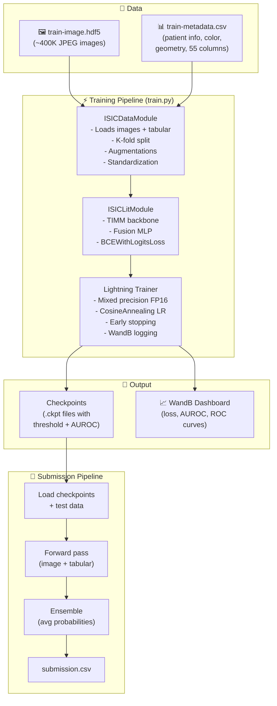
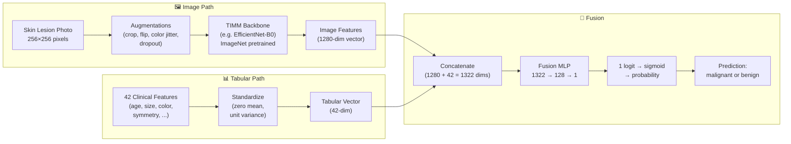
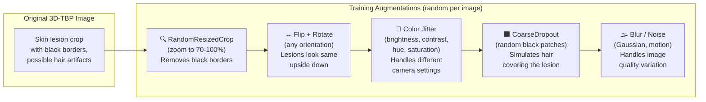
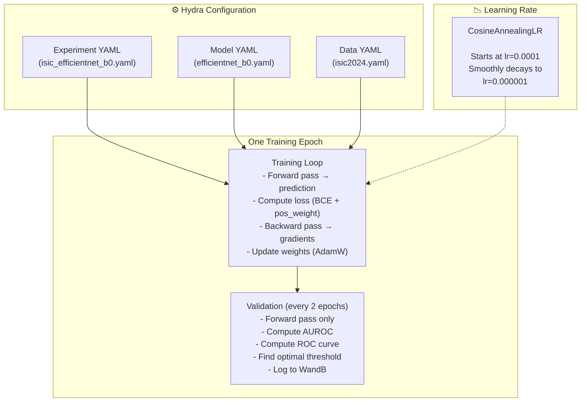
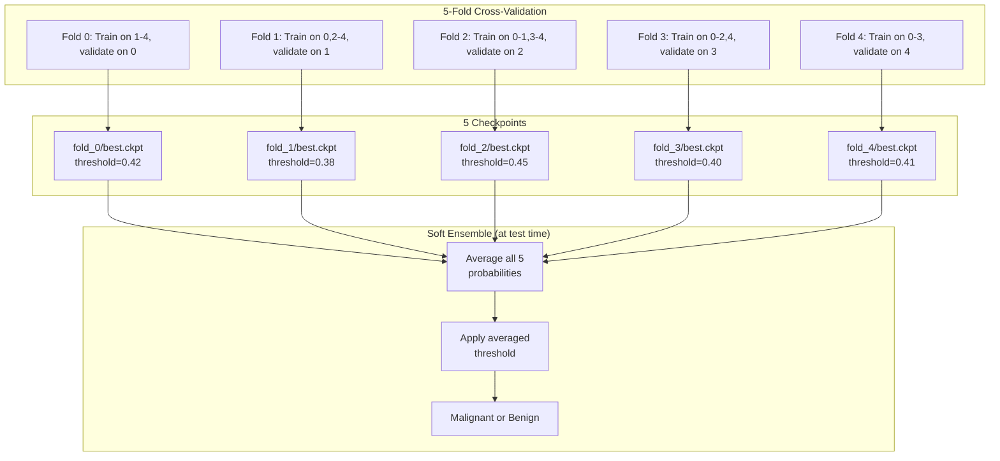
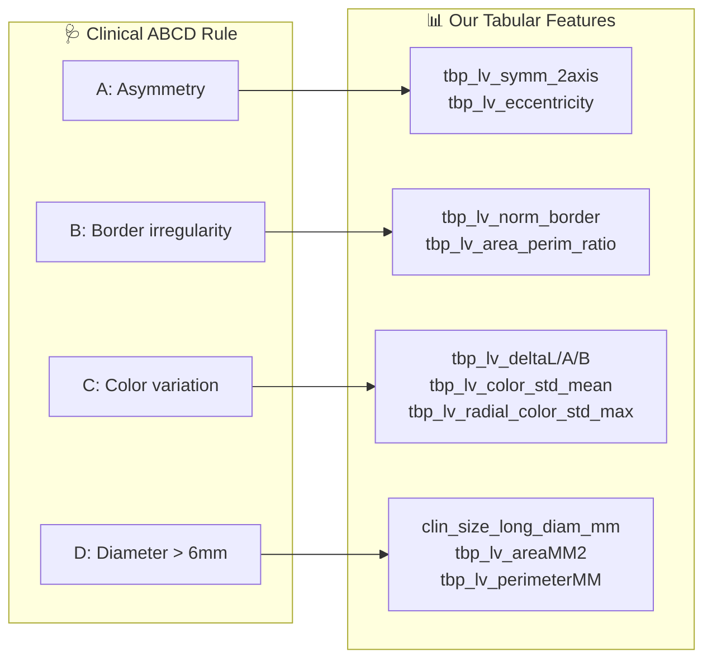

# 🏗️ Architecture — Skin Cancer Detection

> **[← Back to README](../README.md)**

---

## What This Project Does

This project **detects skin cancer from photos**. Given a photo of a skin lesion (mole/spot) and clinical measurements, it predicts whether the lesion is **malignant** (cancerous) or **benign** (harmless).

It was built for the [ISIC 2024 Kaggle Competition](https://www.kaggle.com/competitions/isic-2024-challenge), which uses images from 3D Total Body Photography (3D-TBP) — a system that photographs a patient's entire body and extracts crops of individual lesions.

---

## System Overview



---

## How the Model Works

### The Problem with Just Looking at Photos

A photo alone often isn't enough to tell if a mole is cancerous. Dermatologists also consider:
- **Patient age** — risk increases with age
- **Location on body** — some sites are higher risk
- **Lesion size, shape, and color** relative to surrounding skin

Our model does the same — it looks at both the **image** and these **clinical measurements** (tabular features).

### Image + Tabular Fusion



### Step-by-Step Explanation

1. **Image Path**: The skin lesion photo (256×256) goes through a pre-trained backbone network (like EfficientNet). This backbone was originally trained on ImageNet (millions of everyday objects) and has learned to extract visual features (edges, textures, colors). We strip off its final classification layer and use the **feature vector** it produces (e.g., 1280 numbers that represent the image).

2. **Tabular Path**: 42 clinical measurements are extracted from the metadata CSV. These are standardized so each feature has mean=0 and std=1 (otherwise features with large values like `tbp_lv_y=1500` would dominate over features like `eccentricity=0.9`).

3. **Fusion**: The image feature vector (1280 dims) and tabular vector (42 dims) are concatenated into one long vector (1322 dims). This goes through a small MLP that learns to combine both signals:
   ```
   Linear(1322 → 128) → BatchNorm → ReLU → Dropout → Linear(128 → 1)
   ```
   The final output is a single number (logit). We apply sigmoid to get a probability between 0 and 1.

---

## Tabular Features

The metadata CSV contains clinical measurements taken by the 3D-TBP system:

### Patient Demographics

| Feature | What it is |
|---------|-----------|
| `age_approx` | Patient's approximate age (5–85) |
| `sex` | Male/Female → encoded as 1/0 |
| `anatom_site_general` | Where on the body → one-hot encoded (head, arms, legs, torso, etc.) |

### Lesion Size & Shape

| Feature | What it is |
|---------|-----------|
| `clin_size_long_diam_mm` | Longest diameter in mm |
| `tbp_lv_areaMM2` | Lesion area in mm² |
| `tbp_lv_perimeterMM` | Perimeter in mm |
| `tbp_lv_minorAxisMM` | Shortest diameter |
| `tbp_lv_area_perim_ratio` | How compact/round the shape is |
| `tbp_lv_eccentricity` | How elongated (0=circle, 1=line) |
| `tbp_lv_symm_2axis` | How symmetric the lesion is |

### Lesion Color (LAB Color Space)

The 3D-TBP system measures colors in LAB color space (L=lightness, A=red-green, B=yellow-blue):

| Feature | What it is |
|---------|-----------|
| `tbp_lv_L`, `tbp_lv_A`, `tbp_lv_B` | Lesion color |
| `tbp_lv_Lext`, `tbp_lv_Aext`, `tbp_lv_Bext` | **Surrounding** skin color |
| `tbp_lv_deltaL/A/B` | **Difference** (lesion − surround) |
| `tbp_lv_H`, `tbp_lv_C` | Hue and Chroma |
| `tbp_lv_stdL`, `tbp_lv_stdLExt` | Color variation within lesion/surround |
| `tbp_lv_color_std_mean` | Overall color non-uniformity |
| `tbp_lv_radial_color_std_max` | Max color variation from center to edge |

> [!TIP]
> **Why color matters**: Malignant lesions often have irregular color patterns — multiple shades of brown, black, red, or blue within the same lesion. The `delta` features capture how much the lesion differs from surrounding healthy skin.

### Border & Confidence

| Feature | What it is |
|---------|-----------|
| `tbp_lv_norm_border` | Border regularity score (irregular borders = suspicious) |
| `tbp_lv_norm_color` | Color uniformity score |
| `tbp_lv_nevi_confidence` | DNN confidence that it's a normal mole |
| `tbp_lv_dnn_lesion_confidence` | DNN confidence that it's a lesion at all |

### 3D Body Position

| Feature | What it is |
|---------|-----------|
| `tbp_lv_x`, `tbp_lv_y`, `tbp_lv_z` | 3D coordinates on the body surface |

---

## Data Augmentation

ISIC 2024 images have specific characteristics that our augmentations address:



**Why augment?** We only have ~400K images, but we need the model to be robust to:
- Different camera angles → flips, rotations
- Different lighting/color calibration → color jitter
- Hair or artifacts covering the lesion → CoarseDropout
- Lesion being in different parts of the crop → RandomResizedCrop

---

## Training Pipeline



### Key Training Concepts

- **BCEWithLogitsLoss + pos_weight**: Binary Cross-Entropy loss for classification. The `pos_weight` (~199) tells the loss function: "each malignant sample is worth 199 benign samples." Without this, the model would predict "benign" for everything and still get 99.5% accuracy.

- **CosineAnnealing LR**: The learning rate starts at 0.0001 and smoothly decreases to 0.000001 following a cosine curve. Early in training, we want big steps; near the end, tiny steps for fine-tuning.

- **Mixed Precision (FP16)**: Uses 16-bit floating point for most computations. ~2× faster, ~half GPU memory, negligible quality loss.

---

## Cross-Validation & Ensemble



**Why 5 folds?** Each model sees 80% of data during training. By training 5 models on different 80% slices, we:
1. Use ALL data for both training and validation (just not at the same time)
2. Get more robust predictions by averaging 5 opinions
3. Reduce overfitting

**Patient-level splitting**: We split by `patient_id`, not by image. This prevents data leakage — if the same patient has 10 lesion photos, all 10 go into the same fold.

---

## ABCD Rule Connection

Dermatologists use the **ABCD rule** to evaluate moles. Our tabular features capture the same concepts:



---

## Tools & Libraries

| Tool | What it does | Why we use it |
|------|-------------|---------------|
| **PyTorch** | Deep learning framework | Core tensor operations, autograd, GPU support |
| **Lightning** | Training framework | Handles training loop, logging, checkpoints, multi-GPU |
| **TIMM** | Pre-trained model zoo | 700+ ImageNet-pretrained backbones |
| **Hydra** | Configuration management | Mix-and-match experiment configs |
| **Albumentations** | Image augmentation | Fast, GPU-friendly augmentation pipeline |
| **torchmetrics** | Metric computation | Efficient AUROC and ROC curve computation |
| **WandB** | Experiment tracking | Training curves, ROC plots, hyperparameters dashboard |
| **h5py** | HDF5 file I/O | Reads images from competition's HDF5 format |
| **Gradio** | Web UI | Interactive prediction demo |

---

## How to Run

### Training (on Kaggle)

1. Open `notebooks/skin-cancer-detection.ipynb` in Kaggle
2. Attach the `isic-2024-challenge` dataset
3. Set `MODELS_TO_TRAIN` and `FOLDS_TO_TRAIN` in Cell 4
4. Run all cells → checkpoints saved to `/kaggle/working/checkpoints/`

### Training (Local)

```bash
python src/train.py experiment=isic_efficientnet_b0 data.fold=0 logger=wandb
```

### Submission (on Kaggle)

1. Open `notebooks/submission.ipynb`
2. Attach competition data + your training notebook output as a dataset
3. Run all cells → `submission.csv` generated
4. Submit the notebook

> 📖 [Technical reference](reference.md) &nbsp;|&nbsp; [Gradio demo guide](gradio-demo.md)
