# 🎨 Gradio Demo — Skin Cancer Detection UI

> **[← Back to README](../README.md)**

A web-based prediction interface for the ISIC 2024 skin cancer detection model. Upload a skin lesion image, select model checkpoint(s), and get a malignant/benign prediction with confidence score.

The demo is maintained as a Git submodule that natively deploys to [Hugging Face Spaces](https://huggingface.co/spaces/RudraShivm/skin-cancer-detection-demo).

---

## Running Locally

If you have PyTorch installed locally:

```bash
# 1. Pull the demo submodule (if you haven't already)
git submodule update --init --recursive

# 2. Download pretrained checkpoints
python scripts/download_checkpoints.py

# 3. Launch the app
python demo/app.py
```

Then open `http://localhost:7860` in your browser. The app will automatically find the checkpoints in the parent repo's `checkpoints/` directory.

---

## Deploying to Hugging Face Spaces

The `demo/` folder is a self-contained Hugging Face Space repository. When you update it and push, the Space rebuilds automatically.

### Adding Sample Images

1. Add your `.jpg` images from the ISIC 2024 dataset to `demo/samples/`
2. Update `demo/samples/samples.json` with the corresponding metadata (age, sex, site, label)
3. Push the changes from inside the `demo/` directory

### Push Updates to HF Spaces

```bash
cd demo/
git add .
git commit -m "Updated sample images"
git push origin main
```

---

## Quick Start (Google Colab / Kaggle)

Copy this entire cell into a notebook with **GPU runtime** enabled:

```python
# 1. Clone repo WITH submodules
!git clone --recursive https://github.com/RudraShivm/Skin-Cancer-Detection.git
%cd Skin-Cancer-Detection

# 2. Install dependencies
!pip install -q gradio timm albumentations pytorch-lightning torchmetrics huggingface_hub

# 3. Launch the app with a public share link
import sys
sys.argv = ['app.py']  # Clear colab args
!python demo/app.py
```

Wait for checkpoints to auto-download on startup, then click the `https://xxxx.gradio.live` link.

---

## How It Works

### Architecture

```mermaid
flowchart LR
    subgraph UI["🖥️ Gradio Web Interface"]
        IMG_UP["📷 Image Upload"]
        CKPT_SEL["🎛 Checkpoint Selector"]
        META["📋 Patient Metadata"]
        BTN["🔍 Analyze Button"]
    end

    subgraph Backend["⚡ Python Backend"]
        LOAD["Load checkpoint(s)"]
        PREPROCESS["Preprocess image"]
        ENCODE["Encode tabular"]
        FORWARD["Model forward pass"]
        ENSEMBLE["Average probabilities"]
    end

    subgraph Output["📊 Results"]
        PIPELINE["Visual Pipeline Flow"]
        PRED["🟢 BENIGN / 🔴 MALIGNANT"]
        CONF["Probability Bar"]
    end

    IMG_UP --> PREPROCESS
    CKPT_SEL --> LOAD
    META --> ENCODE
    BTN --> FORWARD
    PREPROCESS --> FORWARD
    LOAD --> FORWARD
    ENCODE --> FORWARD
    FORWARD --> ENSEMBLE --> PIPELINE
    ENSEMBLE --> PRED
    ENSEMBLE --> CONF
```



### Tabular Feature Handling

The model expects 43 tabular features during training. In the Gradio demo, the user only provides 3 (age, sex, site). The remaining 40 features are set to **0**, which after standardization corresponds to the **mean value** — so the model treats them as "average/unknown." Predictions are driven primarily by the image, with age/sex/site providing minor corrections.

---

## Code Structure (in `demo/`)

| File | Purpose |
|------|---------|
| `app.py` | Self-contained Gradio app (auto-downloads checkpoints, runs inference) |
| `requirements.txt` | Minimal dependencies for the Space |
| `README.md` | HF Spaces YAML configuration |
| `samples/` | Sample images and `samples.json` metadata |

---

## Troubleshooting

| Problem | Fix |
|---------|-----|
| "No local checkpoints found" | The app will auto-download them from HF Hub on startup |
| `demo/app.py` not found | Run `git submodule update --init --recursive` |
| Colab public link expires | Links last 72 hours. Re-run the cell to get a new one |

> 📖 [Technical reference](reference.md)  |  [Architecture docs](architecture.md)
